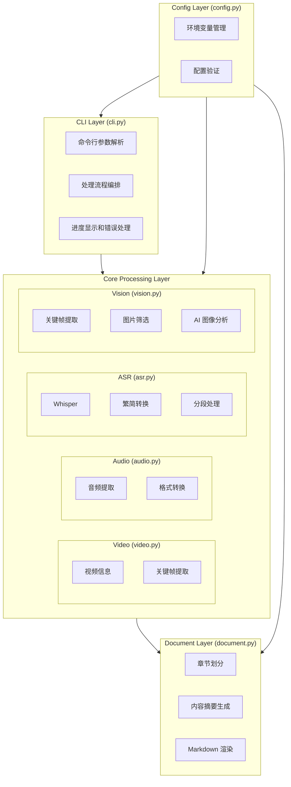
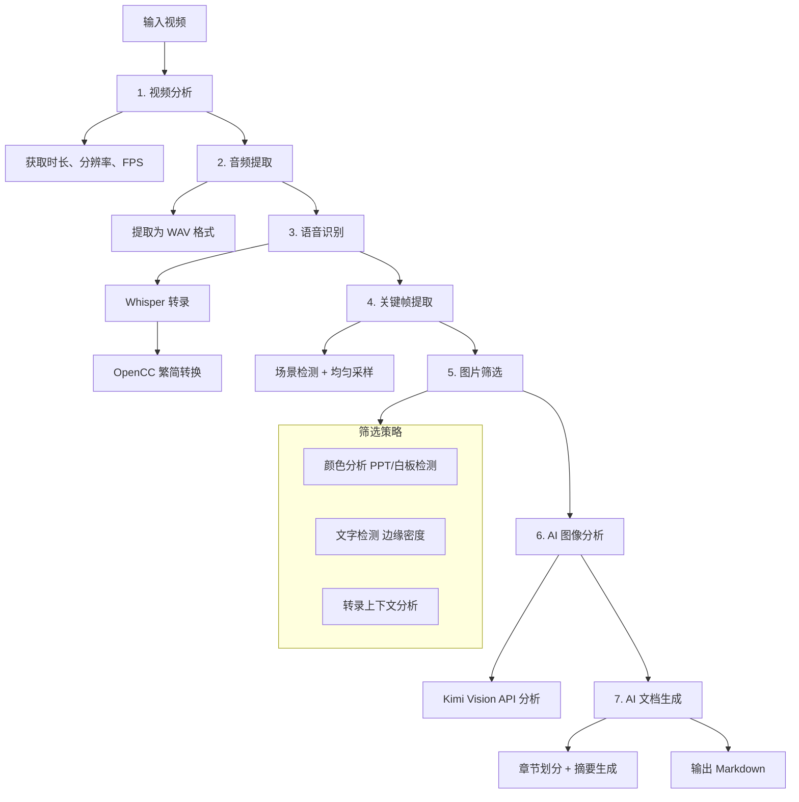

# Video2Markdown 架构设计

> 📋 详细处理流程请查看 [WORKFLOW.md](./WORKFLOW.md)

## 1. 系统架构



## 2. 处理流程



## 3. 模块详细设计

### 3.1 CLI (cli.py)

```python
class VideoProcessor:
    def process(self, video_path, output_path, options)
        # 1. 分析视频
        # 2. 转录音频
        # 3. 提取关键帧
        # 4. 分析图片
        # 5. 生成文档
```

### 3.2 ASR (asr.py)

```python
@dataclass
class TranscriptSegment:
    start_time: float    # 开始时间（秒）
    end_time: float      # 结束时间（秒）
    text: str           # 文本内容（简体中文）

class WhisperTranscriber:
    def transcribe(audio_path) -> list[TranscriptSegment]
    def to_simplified_chinese(text) -> str  # OpenCC 转换
```

### 3.3 Vision (vision.py)

```python
class ImageAnalyzer:
    def extract_keyframes(video_path, interval) -> list[Keyframe]
    
    def should_analyze_image(image_path, transcript) -> tuple[bool, str]
        # 1. 检查是否是 PPT/白板（颜色分析）
        # 2. 检查文字密度（边缘检测）
        # 3. 检查转录上下文
        
    def analyze_with_ai(image_path, context) -> str
        # 调用 Kimi Vision API
```

### 3.4 Document (document.py)

```python
class DocumentGenerator:
    def generate(transcript, images) -> str
        chapters = self.create_chapters(transcript)
        return self.render_markdown(chapters, images)
    
    def create_chapters(transcript) -> list[Chapter]
        # 使用 Kimi 分析内容，划分章节
        
    def render_markdown(chapters, images) -> str
        # 渲染为 Markdown 格式
```

## 4. 数据流

### 4.1 转录数据

**数据结构：**

| 字段 | 类型 | 说明 |
|------|------|------|
| `start_time` | float | 开始时间（秒） |
| `end_time` | float | 结束时间（秒） |
| `text` | str | 文本内容（简体中文） |

**流程：** `Whisper JSON Output` → `TranscriptSegment[]`

### 4.2 关键帧数据

**数据结构：**

| 字段 | 类型 | 说明 |
|------|------|------|
| `frame_path` | Path | 帧文件路径 |
| `timestamp` | float | 时间戳（秒） |
| `image_type` | str | 图片类型：ppt, whiteboard, speaker 等 |
| `description` | str | AI 生成的描述 |

### 4.3 章节数据

**数据结构：**

| 字段 | 类型 | 说明 |
|------|------|------|
| `title` | str | 章节标题 |
| `start_time` | float | 开始时间（秒） |
| `end_time` | float | 结束时间（秒） |
| `summary` | str | AI 生成的摘要 |
| `transcript` | str | 原始转录文本 |
| `images` | list[Keyframe] | 相关图片列表 |

## 5. 关键设计决策

### 5.1 Text-First 设计

- **核心原则**：文字内容是主体，图片是辅助
- **实现方式**：
  - 优先使用 Whisper 转录的完整内容
  - AI 章节划分基于文字内容
  - 图片仅用于补充文字无法表达的信息

### 5.2 智能图片筛选

**目的**：减少不必要的 API 调用，降低成本和时间

**策略**：

| 筛选层级 | 方法 | 节省率 |
|---------|------|-------|
| 第一层 | 颜色分析（检测 PPT/白板） | 30% |
| 第二层 | 文字密度检测（OpenCV） | 20% |
| 第三层 | 转录上下文分析 | 20% |

### 5.3 模型选择

| 用途 | 模型 | 理由 |
|-----|------|------|
| 语音识别 | whisper.cpp (local) | 免费、离线、保护隐私 |
| 文本生成 | kimi-k2.5 | 中文理解能力强、上下文长 |
| 图像理解 | kimi-k2.5 | 支持视觉、性价比高 |

### 5.4 错误处理策略

- **可恢复错误**：跳过当前步骤，继续处理（如单张图片分析失败）
- **关键错误**：终止处理，返回错误信息（如视频文件不存在）
- **降级策略**：如果 AI 服务不可用，仍输出基础转录和关键帧

## 6. 扩展性设计

### 6.1 添加新的 ASR 提供商

```python
# asr.py
class BaseTranscriber(ABC):
    @abstractmethod
    def transcribe(self, audio_path) -> list[TranscriptSegment]:
        pass

class WhisperTranscriber(BaseTranscriber): ...
class OpenAITranscriber(BaseTranscriber): ...
class AzureTranscriber(BaseTranscriber): ...  # 新增
```

### 6.2 添加新的输出格式

```python
# document.py
class BaseRenderer(ABC):
    @abstractmethod
    def render(self, chapters) -> str:
        pass

class MarkdownRenderer(BaseRenderer): ...
class PDFRenderer(BaseRenderer): ...  # 新增
class WordRenderer(BaseRenderer): ...  # 新增
```

## 7. 配置体系

配置优先级（从高到低）：

1. **命令行参数**
   ```bash
   video2md process --keyframe-interval 60
   ```

2. **环境变量**
   ```bash
   export KIMI_KEYFRAME_INTERVAL=60
   ```

3. **.env 文件**
   ```
   KIMI_KEYFRAME_INTERVAL=60
   ```

4. **默认值**
   - 代码中定义的默认值
