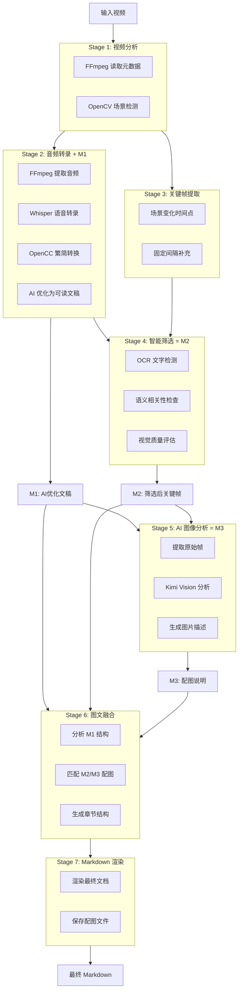

# Video2Markdown 架构设计

> 📋 详细处理流程请查看 [WORKFLOW.md](./WORKFLOW.md)

## 1. 系统架构



## 2. 模块结构

### 2.1 Stage 模块（核心处理）

| 文件 | 功能 | 输入 | 输出 |
|------|------|------|------|
| `stage1_analyze.py` | 视频分析 | 视频文件 | `VideoInfo` |
| `stage2_transcribe.py` | 音频转录 + AI优化 | 视频 + `VideoInfo` | `VideoTranscript` (M1) |
| `stage3_keyframes.py` | 关键帧提取 | 视频 + `VideoInfo` | `KeyFrames` (候选) |
| `stage4_filter.py` | 智能图片筛选 | `KeyFrames` + M1 | `KeyFrames` (M2) |
| `stage5_analyze_images.py` | AI图像分析 | M1 + M2 | `ImageDescriptions` (M3) |
| `stage6_generate.py` | 图文融合 | M1 + M2 + M3 | `Document` |
| `stage7_render.py` | Markdown渲染 | `Document` + M1 + M3 | `.md` 文件 |

### 2.2 支持模块

| 文件 | 功能 |
|------|------|
| `cli.py` | 命令行接口，定义 `stage1`~`stage6` 和 `process` 命令 |
| `config.py` | 配置管理（环境变量、.env、路径解析） |
| `models.py` | 数据模型（`VideoInfo`, `TranscriptSegment`, `KeyFrame`, 等） |

## 3. 数据模型

### 3.1 核心模型

```python
@dataclass
class VideoInfo:
    path: Path
    duration: float          # 秒
    width: int
    height: int
    fps: float
    scene_changes: list[float]

@dataclass
class TranscriptSegment:
    start: float             # 开始时间 (秒)
    end: float               # 结束时间 (秒)
    text: str                # 文本内容

@dataclass
class VideoTranscript:      # M1
    video_path: Path
    title: str
    language: str
    segments: list[TranscriptSegment]
    optimized_text: str      # AI 优化后的文稿

@dataclass
class KeyFrame:
    timestamp: float         # 时间点 (秒)
    source: str              # 来源: scene_change / interval / transcript_hint
    reason: str              # 选择原因

@dataclass
class KeyFrames:            # M2
    video_path: Path
    frames: list[KeyFrame]

@dataclass
class ImageDescription:
    timestamp: float
    image_path: Path
    description: str         # AI 描述
    key_elements: list[str]
    related_transcript: str

@dataclass
class ImageDescriptions:    # M3
    descriptions: list[ImageDescription]

@dataclass
class Chapter:
    id: int
    title: str
    start_time: float
    end_time: float
    summary: str
    key_points: list[str]
    cleaned_transcript: str
    visual_timestamp: Optional[float]
    visual_reason: Optional[str]

@dataclass
class Document:
    title: str
    chapters: list[Chapter]
```

## 4. 缓存机制

Stage 2 实现了两级缓存：

```
test_outputs/temp/cache/stage2/
└── {video_name}_{hash}_{model}_{lang}_raw.json
```

缓存内容：
- `video_hash`: 视频文件前 1MB 的 SHA256（用于检测视频变化）
- `segments`: Whisper 原始转录结果
- `model`: 使用的模型名称
- `language`: 语言代码

使用 `--no-cache` 跳过缓存，使用 `--clear-cache` 强制重新转录。

## 5. 关键设计决策

### 5.1 Text-First 设计

- **核心原则**：文字内容是主体，图片是辅助
- **实现方式**：
  - 优先使用 Whisper 转录的完整内容
  - AI 章节划分基于文字内容
  - 图片仅用于补充文字无法表达的信息

### 5.2 Prompt 文件化

所有 AI Prompt 提取到 `prompts/` 目录：
- `transcript_optimization.md` - Stage 2c: 文稿优化
- `image_analysis.md` - Stage 5: 图像分析  
- `document_merge.md` - Stage 6: 图文融合

使用 YAML Frontmatter 定义参数：
```yaml
---
name: transcript-optimization
version: "1.0.0"
models: [kimi-k2.5]
parameters:
  temperature: 1
variables: [title, raw_text]
---
```

### 5.3 智能图片筛选

**目的**：减少不必要的 API 调用，降低成本和时间

| 筛选层级 | 方法 | 节省率 |
|---------|------|-------|
| 第一层 | 时间戳去重 | 20% |
| 第二层 | OCR 文字检测 | 30% |
| 第三层 | 语义相关性检查 | 20% |

### 5.4 模型选择

| 用途 | 模型 | 理由 |
|-----|------|------|
| 语音识别 | whisper.cpp (local) | 免费、离线、保护隐私 |
| 文本生成 | kimi-k2.5 | 中文理解能力强、上下文长 |
| 图像理解 | kimi-k2.5 | 支持视觉、性价比高 |

### 5.5 错误处理策略

- **可恢复错误**：跳过当前步骤，继续处理（如单张图片分析失败）
- **关键错误**：终止处理，返回错误信息（如视频文件不存在）
- **降级策略**：如果 AI 服务不可用，仍输出基础转录和关键帧

## 6. 配置体系

配置优先级（从高到低）：

1. **命令行参数**
   ```bash
   uv run python -m video2markdown process --keyframe-interval 60
   ```

2. **环境变量**
   ```bash
   export KIMI_KEYFRAME_INTERVAL=60
   ```

3. **.env 文件**
   ```
   KIMI_KEYFRAME_INTERVAL=60
   ```

4. **默认值**
   - 代码中定义的默认值

## 7. 扩展性设计

### 7.1 添加新的 Stage

Stage 设计遵循统一接口：

```python
def stageX_process(input_data: InputType, ...) -> OutputType:
    """Stage X: 处理描述.
    
    输入: ...
    输出: ...
    """
    print(f"[Stage X] 处理...")
    # 处理逻辑
    return output
```

### 7.2 添加新的 ASR 提供商

在 `stage2_transcribe.py` 中扩展：

```python
def transcribe_audio(audio_path: Path, model_path: Path, language: str) -> list[TranscriptSegment]:
    if settings.asr_provider == "local":
        return _transcribe_with_whisper(audio_path, model_path, language)
    elif settings.asr_provider == "openai":
        return _transcribe_with_openai(audio_path, language)
    # 新增
    elif settings.asr_provider == "azure":
        return _transcribe_with_azure(audio_path, language)
```

### 7.3 添加新的输出格式

在 `stage7_render.py` 中扩展：

```python
def render_document(document: Document, format: str = "markdown") -> str:
    if format == "markdown":
        return _render_markdown(document)
    elif format == "html":
        return _render_html(document)
    # 新增
    elif format == "pdf":
        return _render_pdf(document)
```

---

*最后更新: 2026-02-12 - 更新为 7-Stage 架构*
