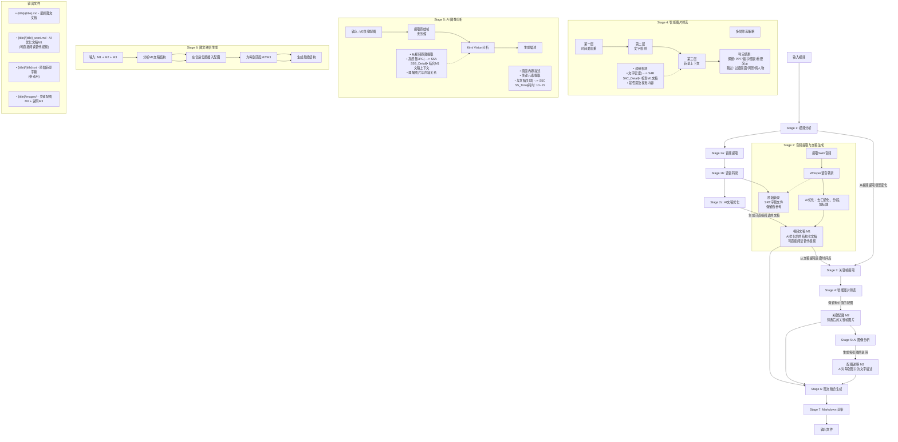
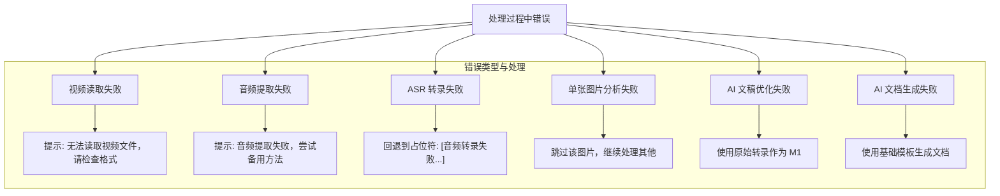
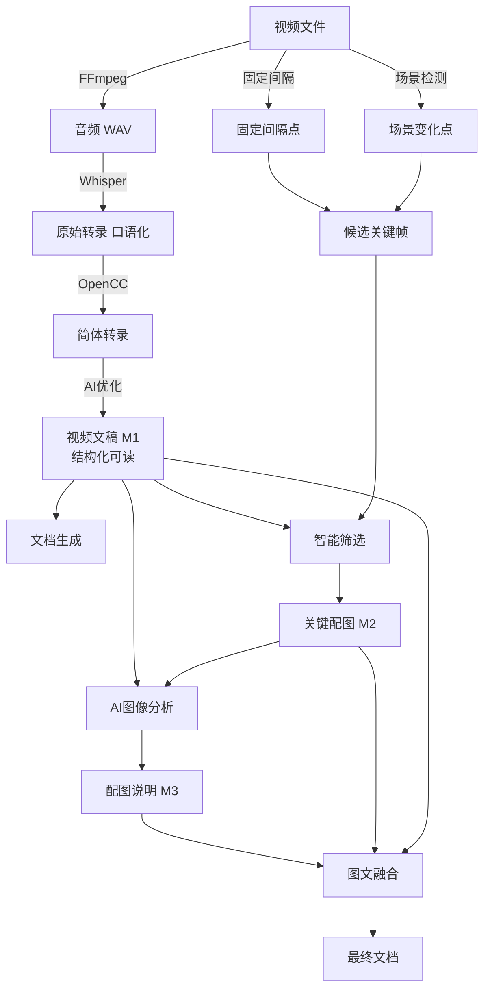

# Video2Markdown 处理流程详解

## 整体架构流程



## 核心概念：M1/M2/M3 中间产物

### M1: 视频文稿（AI优化后）

**定义**: 经过 AI 优化的结构化文稿，可直接阅读替代视频

**特点**:
- ❌ 不是口语化转录
- ✅ 是经过 AI 优化的正式文稿
- ✅ 有段落结构、小标题
- ✅ 去除重复、语气词、口头禅
- ✅ 专业术语准确

**生成流程**:
```
原始音频 → Whisper转录(口语化) → AI优化 → M1(可读文稿)
```

**输出文件**:
- `{title}_word.md` - AI优化后的文稿
- 可以直接阅读，无需看视频

### M2: 关键配图

**定义**: 经过智能筛选后需要保留的关键帧图片

**筛选标准**:
1. 时间戳去重（避免连续重复帧）
2. 文字检测（保留有 PPT/板书/代码的画面）
3. 上下文检查（M1文稿提及的视觉内容）

**输出**:
- `{title}_frames/frame_*.jpg` - 原始质量截图

### M3: 配图说明

**定义**: AI 对每张 M2 图片的文字描述

**内容**:
- 画面主要内容
- 提取的文字（如有）
- 与 M1 文稿的关联

**输出**:
- `{title}_frames/frame_*.txt` - 每张图的说明

## 详细处理时间分析

### 典型视频处理时间 (5-8 分钟)

| 阶段 | 耗时 | 占比 | 说明 |
|-----|------|-----|------|
| Stage 1: 视频分析 | < 1s | < 1% | FFmpeg 读取元数据 |
| Stage 2a: 音频提取 | 2-3s | 2% | FFmpeg 提取 WAV |
| Stage 2b: 语音转录 | 60-90s | 25% | Whisper 本地处理 |
| Stage 2c: AI文稿优化 | 20-30s | 10% | Kimi API，优化为可读文稿 |
| Stage 3: 关键帧提取 | 2-3s | 2% | OpenCV 处理 |
| Stage 4: 智能筛选 | 1-2s | < 1% | 本地 OpenCV，无 API 调用 |
| Stage 5: 图片分析 | 80-120s | 40% | Kimi Vision API，10-15s/张 |
| Stage 6: 图文融合 | 20-30s | 10% | Kimi API，整合 M1+M2+M3 |
| Stage 7: Markdown渲染 | < 1s | < 1% | 本地处理 |
| **总计** | **~4-6 分钟** | **100%** | |

### 长视频处理时间 (20-30 分钟)

| 阶段 | 预估耗时 | 说明 |
|-----|---------|------|
| 语音转录 | 4-6 分钟 | 与时长成正比 |
| AI文稿优化 | 30-60s | 文稿量增加 |
| 图片分析 | 3-5 分钟 | 帧数增加 |
| 图文融合 | 30-60s | 复杂度增加 |
| **总计** | **~15-20 分钟** | |

## 性能优化建议

### 1. 减少 API 调用时间

```bash
# 增大关键帧间隔，减少图片数量
video2md process video.mp4 --keyframe-interval 60  # 默认 30
```

### 2. 使用更快的 Whisper 模型

```bash
# .env 配置
KIMI_WHISPER_MODEL=base  # 更快但准确度略低
```

### 3. 跳过图片分析（仅生成文稿）

```bash
# 如果只需要 M1 文稿，不需要配图
video2md stage2 video.mp4  # 只生成 M1
```

## 错误处理流程



## 数据流转换



## 文件输出规范

输出目录结构：

```
test_outputs/results/
└── {filename}/                          # 以视频标题命名的文件夹
    ├── {filename}.md                    # 最终图文文档
    ├── {filename}_word.md               # M1: AI优化文稿（核心产物）
    ├── {filename}.srt                   # 原始转录字幕（参考）
    └── {filename}_frames/               # M2 + M3
        ├── frame_0001_15.5s.jpg         # 关键配图
        ├── frame_0001_15.5s.txt         # M3: 配图说明
        ├── frame_0002_45.2s.jpg
        └── ...
```

### 各文件用途

| 文件 | 用途 | 是否必须 |
|-----|------|---------|
| `{filename}_word.md` | **M1: AI优化文稿**，可直接阅读替代视频 | ✅ 核心产物 |
| `{filename}.md` | 最终图文文档，包含配图 | ✅ 完整产物 |
| `{filename}.srt` | 原始转录字幕，用于核对 | 参考 |
| `{filename}_frames/` | M2 配图 + M3 说明 | 有配图时 |

## 配置参数影响

| 参数 | 影响 | 默认值 | 建议 |
|-----|------|-------|------|
| `--keyframe-interval` | 图片数量 | 30s | 短视频 20s，长视频 60s |
| `--language` | 转录语言 | zh | 根据视频语音设置 |
| `KIMI_WHISPER_MODEL` | 转录速度/准确度 | medium | tiny(快) / medium(准) |
| `KIMI_MODEL` | AI优化质量 | kimi-k2.5 | 通常无需修改 |

---

*最后更新: 2024-02-12 - 更新 M1 定义为 AI 优化后的可读文稿*
