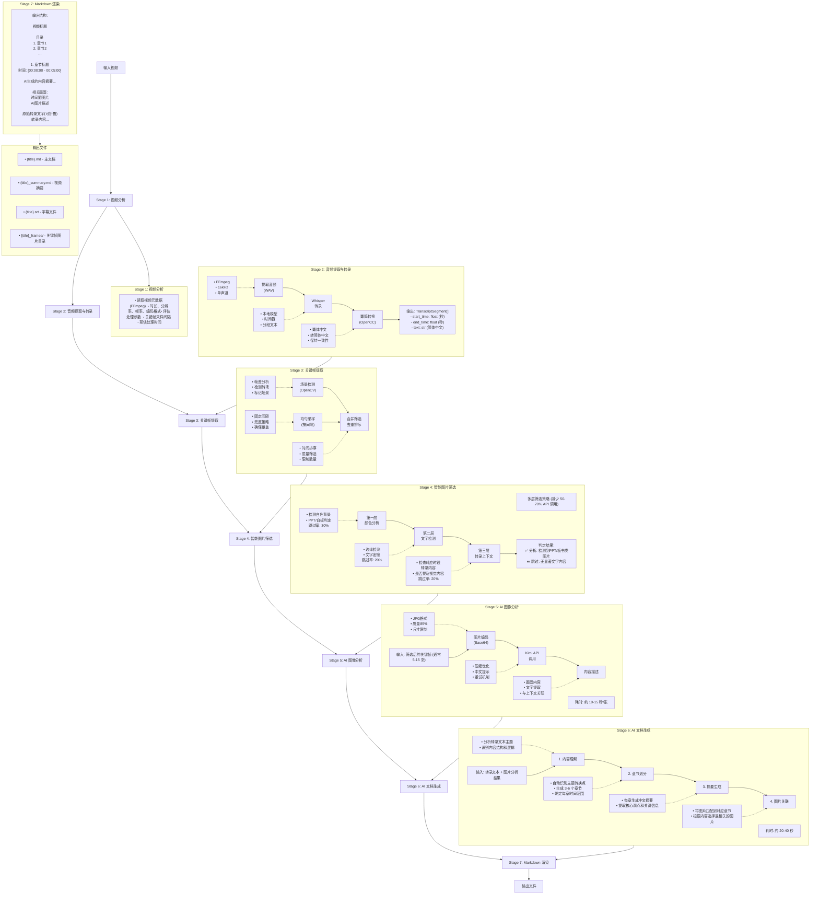
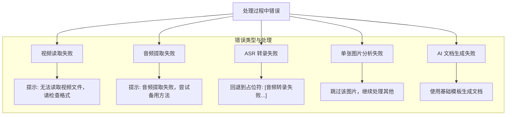

# Video2Markdown 处理流程详解

## 整体架构流程



## 详细处理时间分析

### 典型视频处理时间 (5-8 分钟)

| 阶段 | 耗时 | 占比 | 说明 |
|-----|------|-----|------|
| 视频分析 | < 1s | < 1% | FFmpeg 读取元数据 |
| 音频提取 | 2-3s | 2% | FFmpeg 提取 WAV |
| **语音转录** | **60-90s** | **35%** | Whisper 本地处理 |
| 关键帧提取 | 2-3s | 2% | OpenCV 处理 |
| **智能筛选** | **1-2s** | **< 1%** | 本地 OpenCV，无 API 调用 |
| **图片分析** | **80-120s** | **45%** | Kimi Vision API，10-15s/张 |
| **文档生成** | **30-40s** | **15%** | Kimi API |
| Markdown 渲染 | < 1s | < 1% | 本地处理 |
| **总计** | **~4-6 分钟** | **100%** | |

### 长视频处理时间 (20-30 分钟)

| 阶段 | 预估耗时 | 说明 |
|-----|---------|------|
| 语音转录 | 4-6 分钟 | 与时长成正比 |
| 图片分析 | 3-5 分钟 | 帧数增加 |
| 文档生成 | 40-60s | 文本量增加 |
| **总计** | **~15-20 分钟** | |

## 性能优化建议

### 1. 减少 API 调用时间

```bash
# 增大关键帧间隔，减少图片数量
video2md process video.mp4 --keyframe-interval 60  # 默认 30
```

### 2. 使用更快的 Whisper 模型

```bash
# .env 配置
KIMI_WHISPER_LOCAL_MODEL=whisper.cpp/models/ggml-base-q8_0.bin  # 更快但准确度略低
```

### 3. 批量处理优化

```bash
# 使用批量脚本，自动跳过已处理视频
./run_batch.sh
```

## 错误处理流程



## 数据流转换

```mermaid
flowchart TD
    Video[视频文件] -->|FFmpeg| Audio[音频 WAV]
    Audio -->|Whisper| Transcript1[转录文本 (繁体)]
    Transcript1 -->|OpenCC| Transcript2[转录文本 (简体)]
    Transcript2 -->|转换| Segments[TranscriptSegment[]]
    
    Segments --> DocGen[文档生成]
    Transcript2 --> DocGen
    
    DocGen --> Chapter[章节划分]
    Chapter --> Summary[摘要生成]
    Summary --> Markdown[Markdown]
    Transcript2 --> Markdown
    
    Frames[关键帧图片] --> Filter[智能筛选]
    Filter --> AI[AI 分析]
    AI --> DocGen
```

## 文件输出规范

输出目录结构：

```
testbench/output/
├── {filename}.md              # 主 Markdown 文档
├── {filename}_summary.md      # 视频摘要 (要点列表)
├── {filename}.srt             # SRT 字幕文件
└── {filename}_frames/         # 关键帧目录
    ├── frame_0001_15.557.jpg
    ├── frame_0002_25.108.jpg
    └── ...
```

## 配置参数影响

| 参数 | 影响 | 默认值 | 建议 |
|-----|------|-------|------|
| `--keyframe-interval` | 图片数量 | 30s | 短视频 20s，长视频 60s |
| `--language` | 转录语言 | zh | 根据视频语音设置 |
| `KIMI_WHISPER_LOCAL_MODEL` | 转录速度/准确度 | small | tiny(快) / medium(准) |
| `KIMI_MODEL` | 文档生成质量 | kimi-k2.5 | 通常无需修改 |

---

*最后更新: 2024-02-10*
